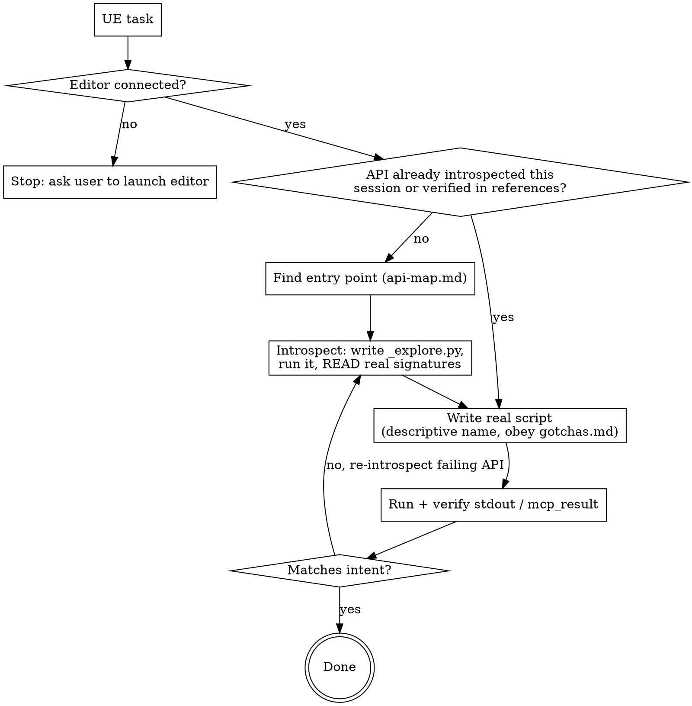

# Driving Unreal via MCP

## Overview

The `run_unreal_script` MCP tool runs a `.py` file from `Content/Python/` inside
Unreal's embedded interpreter (args arrive as the global `mcp_args`; set
`mcp_result` to return JSON data). The `unreal` Python API has thousands of
classes — writing scripts from memory gives wrong signatures and stale calls.

**Core discipline: introspect → verify → write the real script.** Discover the
true API at runtime; do not guess.

## Preflight

- The editor must be running with the `UnrealMcpBridge` plugin. If the tool
  returns `"Unreal editor not connected on 127.0.0.1:8765"`, STOP and ask the
  user to launch it. Do not retry blindly.
- Scripts must live under `Content/Python/` (the scripts root). Paths escaping
  it are rejected.

## Main-line workflow

1. **Preflight** — confirm the editor is connected (above).
2. **Find the entry point** — use `references/api-map.md` to pick the class/subsystem to introspect.
3. **Introspect** — take a template from `references/introspection.md`, write a READ-ONLY exploration script to `Content/Python/_explore.py`, run it via `run_unreal_script`, and READ the real signatures from stdout. Do not guess parameters.
4. **Write the real script** — based on the introspected API, obeying `references/gotchas.md`. Save it with a descriptive name (e.g. `tint_cubes_red.py`) so it is reusable/auditable. `print` progress; return data via `mcp_result`.
5. **Run + verify** — run it, read stdout/`mcp_result`, confirm intent. On error, re-introspect the failing API (back to step 3).

**Skip-introspection exception:** if this session already introspected the API in
question, or the call is one already verified in `references/gotchas.md`, write the
real script directly — don't force an exploration round-trip on simple tasks.

## Red flags — STOP

| Thought | Reality |
|---|---|
| "I know this `unreal` method, I'll write the full script from memory." | The API is huge and version-specific. Introspect first — wrong signatures waste a full run. |
| "I'll skip introspection and just run it; I'll fix errors if they come." | One introspection round-trip is cheaper than guess-fail-guess. Introspect. |
| "I'll assume the method name / argument order." | Read the real signature with `help()`. Assumptions are the #1 failure. |
| "The script worked, I'm done." | Did you SAVE edited assets AND the level if you changed actors? Is `mcp_result` JSON-serializable? Check `gotchas.md`. |
| "Connection error — let me retry the same call." | Editor isn't connected. Stop and ask the user to launch it. |

## References

- `references/introspection.md` — exploration script templates (the toolkit for step 3).
- `references/api-map.md` — which class/subsystem to introspect for a given task.
- `references/gotchas.md` — game thread, transactions, asset saving, serialization, paths.
